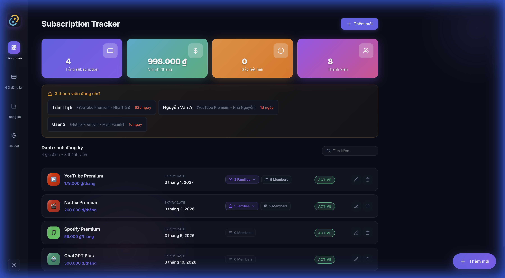
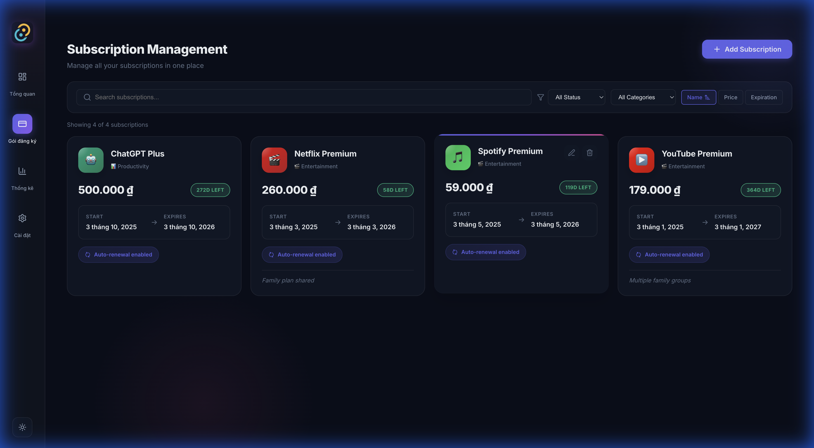
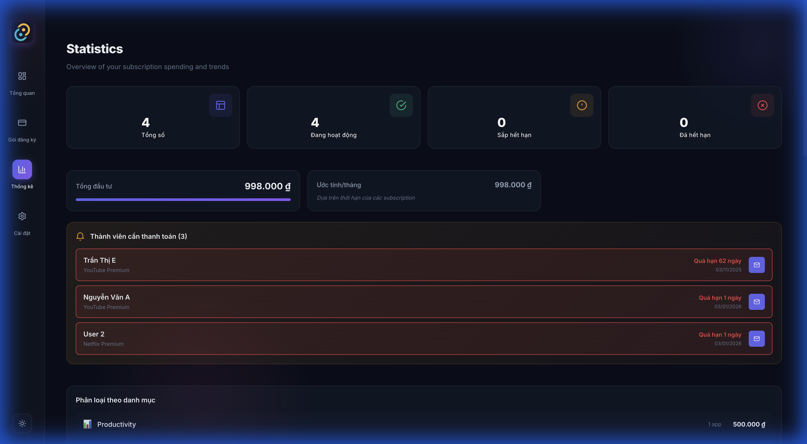

# Subscription Tracker

<div align="center">


**A modern desktop application for managing shared subscriptions and tracking member payments**

[Features](#-features) • [Screenshots](#-screenshots) • [Installation](#-installation) • [Usage](#-usage) • [Development](#-development) • [Contributing](#-contributing)

</div>

---

## 📋 Overview

Subscription Tracker is a cross-platform desktop application built with Tauri and React that helps you manage shared subscription services (like Netflix, Spotify, ChatGPT, etc.) and track member payments efficiently.

Perfect for:
- 👥 **Family Plan Managers** - Track who paid and when
- 💼 **Small Teams** - Manage shared tool subscriptions
- 🏢 **Subscription Resellers** - Monitor multiple accounts and payments

## ✨ Features

### Core Features
- 📦 **Subscription Management** - Add, edit, and organize multiple subscription services
- 👥 **Member Tracking** - Manage members with payment dates and amounts
- 📊 **Dashboard Analytics** - Visual overview of revenue, upcoming payments, and statistics
- 🔔 **Payment Reminders** - Automatic email notifications for upcoming payments

### Advanced Features
- 📧 **EmailJS Integration** - Configurable email notifications with your own credentials
- 🌍 **Multi-language** - English and Vietnamese support
- 🎨 **Dark/Light Theme** - Beautiful UI with theme switching
- 💱 **Multi-currency** - Support for VND, USD, EUR, GBP, JPY, NGN, TRY
- 📤 **Data Export/Import** - Backup and restore your data easily
- 🔒 **Local Storage** - All data stored locally for privacy

## 📸 Screenshots

<div align="center">
<table>
<tr>
<td align="center"><b>Dashboard</b></td>
<td align="center"><b>Subscriptions</b></td>
</tr>
<tr>
<td></td>
<td></td>
</tr>
<tr>
<td align="center"><b>Statistics</b></td>
<td align="center"><b>Settings</b></td>
</tr>
<tr>
<td></td>
<td></td>
</tr>
</table>
</div>

## 📥 Installation

### Download Pre-built Binaries

Download the latest release for your platform from the [Releases](https://github.com/leeberlin/subscription-tracker/releases) page:

| Platform | Download |
|----------|----------|
| **Windows** | `subscription-tracker_x.x.x_x64-setup.exe` or `.msi` |
| **macOS (Apple Silicon)** | `subscription-tracker_x.x.x_aarch64.dmg` |
| **macOS (Intel)** | `subscription-tracker_x.x.x_x64.dmg` |
| **Linux (Debian/Ubuntu)** | `subscription-tracker_x.x.x_amd64.deb` |
| **Linux (Universal)** | `subscription-tracker_x.x.x_amd64.AppImage` |

### Build from Source

See [Development](#-development) section below.

## 🚀 Usage

### Getting Started

1. **Download and install** the application for your platform
2. **Create a subscription** - Click "Add Subscription" and enter details
3. **Add family members** - Create family groups and add members
4. **Track payments** - Monitor payment dates and amounts
5. **Get notified** - Configure EmailJS to receive payment reminders

### Email Notifications Setup

To enable email reminders, you need to configure your own EmailJS credentials:

1. Register at [emailjs.com](https://www.emailjs.com/) (free tier: 200 emails/month)
2. Create an Email Service (Gmail, Outlook, etc.)
3. Create an Email Template with these variables:
   - `{{to_email}}` - Recipient email
   - `{{name}}` - Recipient name
   - `{{subject}}` - Email subject
   - `{{message}}` - Main message
   - `{{members_list}}` - Members list
   - `{{time}}` - Send time
4. Go to **Settings > Email Reminders > Guide** in the app
5. Enter your Service ID, Template ID, and Public Key

## 💻 Development

### Prerequisites

- [Node.js](https://nodejs.org/) v18 or higher
- [Rust](https://www.rust-lang.org/tools/install)
- [Tauri CLI](https://tauri.app/v1/guides/getting-started/prerequisites)

### Setup

```bash
# Clone the repository
git clone https://github.com/leeberlin/subscription-tracker.git
cd subscription-tracker

# Install dependencies
npm install

# Run in development mode
npm run tauri dev

# Build for production
npm run tauri build
```

### Tech Stack

| Technology | Purpose |
|------------|---------|
| [Tauri 2.0](https://tauri.app/) | Desktop framework |
| [React 18](https://reactjs.org/) | UI library |
| [TypeScript](https://www.typescriptlang.org/) | Type safety |
| [Vite](https://vitejs.dev/) | Build tool |
| [Recharts](https://recharts.org/) | Charts & graphs |
| [Lucide React](https://lucide.dev/) | Icons |
| [EmailJS](https://www.emailjs.com/) | Email notifications |

### Project Structure

```
subscription-tracker/
├── src/                    # React frontend
│   ├── components/         # UI components
│   ├── hooks/              # Custom React hooks
│   ├── utils/              # Utility functions
│   ├── types/              # TypeScript types
│   └── i18n/               # Internationalization
├── src-tauri/              # Tauri backend (Rust)
│   ├── src/                # Rust source code
│   └── icons/              # App icons
├── public/                 # Static assets
└── docs/                   # Documentation
```

## 🤝 Contributing

Contributions are welcome! Please feel free to submit a Pull Request.

1. Fork the repository
2. Create your feature branch (`git checkout -b feature/AmazingFeature`)
3. Commit your changes (`git commit -m 'Add some AmazingFeature'`)
4. Push to the branch (`git push origin feature/AmazingFeature`)
5. Open a Pull Request

## 📄 License

This project is licensed under the MIT License - see the [LICENSE](LICENSE) file for details.

## 🙏 Acknowledgments

- [Tauri](https://tauri.app/) - For the amazing desktop framework
- [EmailJS](https://www.emailjs.com/) - For email notification service
- [Lucide](https://lucide.dev/) - For beautiful icons

---

<div align="center">

**Made with ❤️ by [Lee Berlin](https://github.com/leeberlin)**

⭐ Star this repo if you find it useful!

</div>
